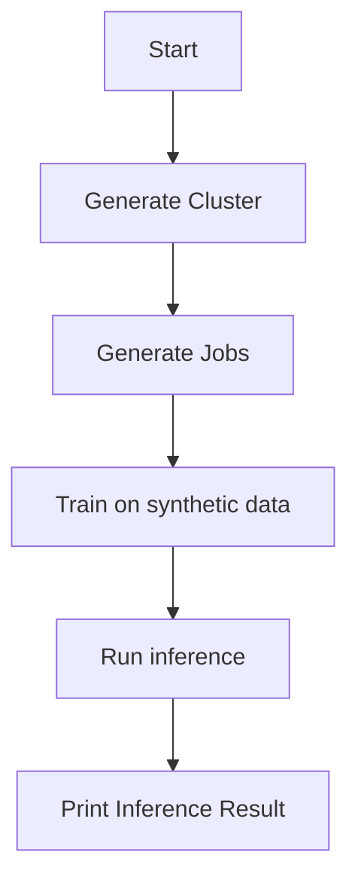
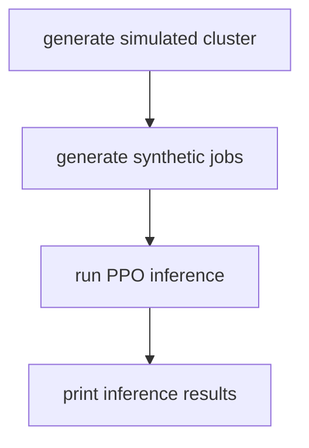
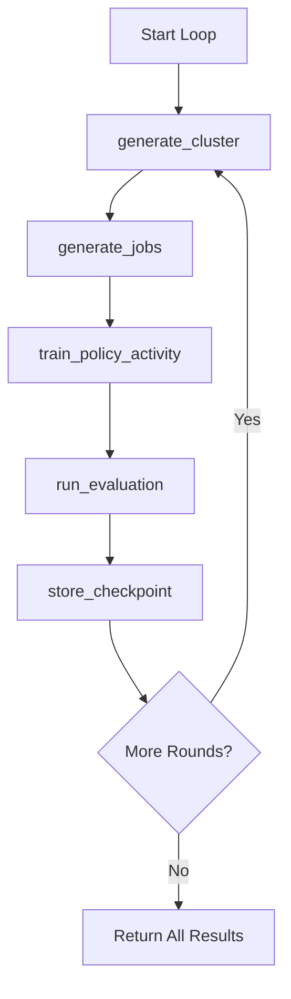

# RL Scheduler with Temporal and Ray RLlib

This project demonstrates how to orchestrate a reinforcement learning (RL) training pipeline using [Temporal](https://temporal.io/) and [Ray RLlib](https://docs.ray.io/en/latest/rllib/index.html). The system simulates a job scheduling environment and trains a PPO policy to optimize job placement in a cluster.

---

## 🧠 Use Case

We train an RL-based job scheduler in a simulated cluster environment. Temporal is used to:

- Orchestrate multi-stage training workflows
- Maintain resilience and recoverability across iterations
- Persist training checkpoints and policy artifacts
- Evaluate the trained policy after training

---

## ⚙️ Architecture

### 🧪 `test_workflow`

A lightweight test of Temporal activity registration and Ray integration.



---

### 🔁 `scheduler_workflow`

This workflow runs inference on a PPO model using Ray RLlib to schedule synthetic job requests to a simulated set of clusters



---

### 🎯 `training_loop_workflow`

Iteratively loops through training rounds, generating fresh data, training the model, and scoring the result with a reward. Will iterate continuously until interrupted via a signal



---

## 📦 Key Components
### TO BE REVISITED
- `env/training_scheduler_env.py`: OpenAI Gym-compatible environment.
- `models/config.py`: Defines the `TrainingConfig` dataclass.
- `activities/train_policy_activity.py`: Trains the PPO policy.
- `activities/run_policy.py`: Loads the policy and computes an action.
- `activities/generate_clusuter.py`: Simulates a compute cluster.
- `activities/generate_jobs.py`: Creates simulated job workloads.
- `workflows/test_workflow.py`: For quick validation of activity registration and Ray setup.
- `workflows/training_workflow.py`: Orchestrates single-round training and evaluation.
- `workflows/training_loop_workflow.py`: Runs multiple training cycles and tracks output.

---

## 🛠 Running the Project

1. **Install dependencies**

```bash
pip install -r requirements.txt
```

2. **Start Temporal (locally or via Temporal Cloud)**

3. **Run the worker**

```bash
python -m client.launch_worker_local.py
```

4. **Trigger the workflows**

- Run all workflows through:

```bash
python -m client.rl_client
```

---

For best results, run the training loop for a while before testing inference. 

## 🔁 Failure Handling

This project uses:
- Temporal activity retries for robustness
- Long-running training with `heartbeat_timeout`
- `to_builtin()` helpers to serialize NumPy values safely

---

## 🧭 Future Extensions

- Use Temporal Signals for dynamic policy updates
- Schedule recurring training via Temporal Schedules
- Store checkpoints in cloud storage (e.g., S3)
- Track performance metrics over time and push to dashboards

---

## 📚 Resources

- [Temporal Python SDK](https://docs.temporal.io/)
- [Ray RLlib](https://docs.ray.io/en/latest/rllib/index.html)
- [OpenAI Gym](https://www.gymlibrary.dev/)
