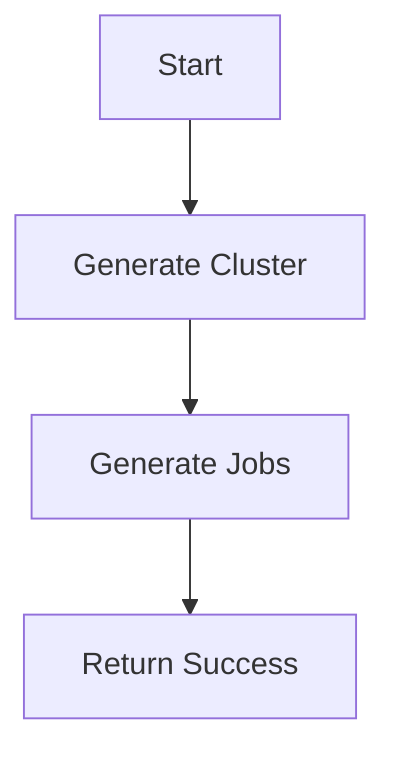
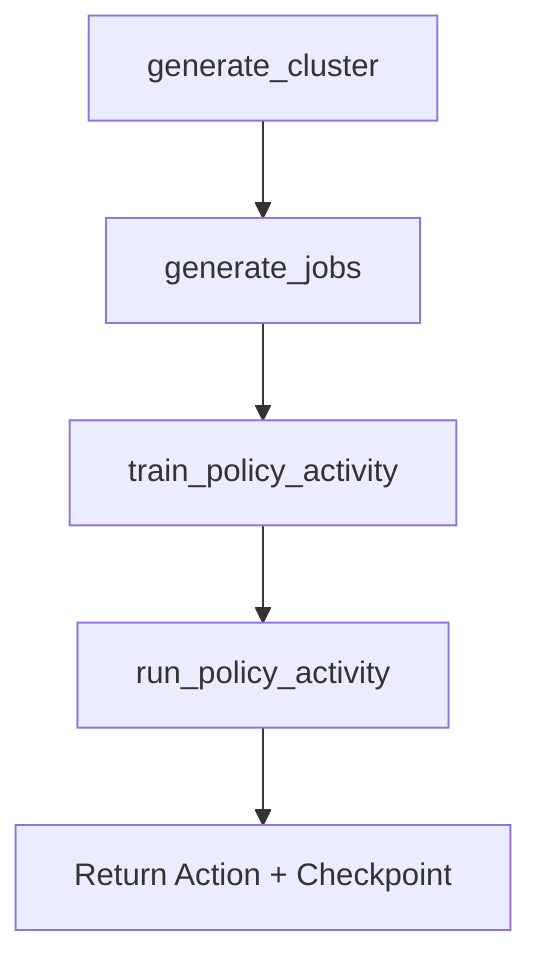
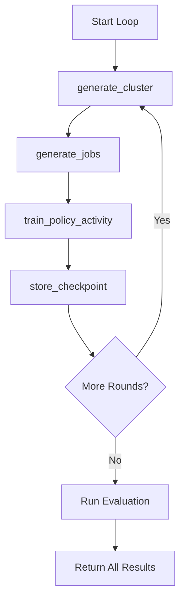

# RL Scheduler with Temporal and Ray RLlib

This project demonstrates how to orchestrate a reinforcement learning (RL) training pipeline using [Temporal](https://temporal.io/) and [Ray RLlib](https://docs.ray.io/en/latest/rllib/index.html). The system simulates a job scheduling environment and trains a PPO policy to optimize job placement in a cluster.

---

## 🧠 Use Case

We train an RL-based job scheduler in a simulated cluster environment. Temporal is used to:

- Orchestrate multi-stage training workflows
- Maintain resilience and recoverability across iterations
- Persist training checkpoints and policy artifacts
- Evaluate the trained policy after training

---

## ⚙️ Architecture

### 🧪 `TestWorkflow`

A lightweight test of Temporal activity registration and Ray integration.



---

### 🔁 `TrainingWorkflow`

Trains a PPO policy using Ray RLlib and evaluates the trained model on a sample observation.



---

### 🎯 `TrainingLoopWorkflow`

Executes multiple PPO training iterations in sequence, potentially with new configurations each round.



---

## 📦 Key Components

- `env/training_scheduler_env.py`: OpenAI Gym-compatible environment.
- `models/config.py`: Defines the `TrainingConfig` dataclass.
- `activities/train_policy_activity.py`: Trains the PPO policy.
- `activities/run_policy.py`: Loads the policy and computes an action.
- `activities/generate_clusuter.py`: Simulates a compute cluster.
- `activities/generate_jobs.py`: Creates simulated job workloads.
- `workflows/test_workflow.py`: For quick validation of activity registration and Ray setup.
- `workflows/training_workflow.py`: Orchestrates single-round training and evaluation.
- `workflows/training_loop_workflow.py`: Runs multiple training cycles and tracks output.

---

## 🛠 Running the Project

1. **Install dependencies**

```bash
pip install -r requirements.txt
```

2. **Start Temporal (locally or via Temporal Cloud)**

3. **Run the worker**

```bash
python deployment/run_worker.py
```

4. **Trigger the workflows**

- Run a test workflow:

```bash
python run_test_workflow.py
```

- Run the training workflow:

```bash
python run_training_workflow.py
```

- Run the loop workflow:

```bash
python run_training_loop_workflow.py
```

---

## 🔁 Failure Handling

This project uses:
- Temporal activity retries for robustness
- Long-running training with `heartbeat_timeout`
- `to_builtin()` helpers to serialize NumPy values safely

---

## 🧭 Future Extensions

- Use Temporal Signals for dynamic policy updates
- Schedule recurring training via Temporal Schedules
- Store checkpoints in cloud storage (e.g., S3)
- Track performance metrics over time and push to dashboards

---

## 📚 Resources

- [Temporal Python SDK](https://docs.temporal.io/)
- [Ray RLlib](https://docs.ray.io/en/latest/rllib/index.html)
- [OpenAI Gym](https://www.gymlibrary.dev/)
